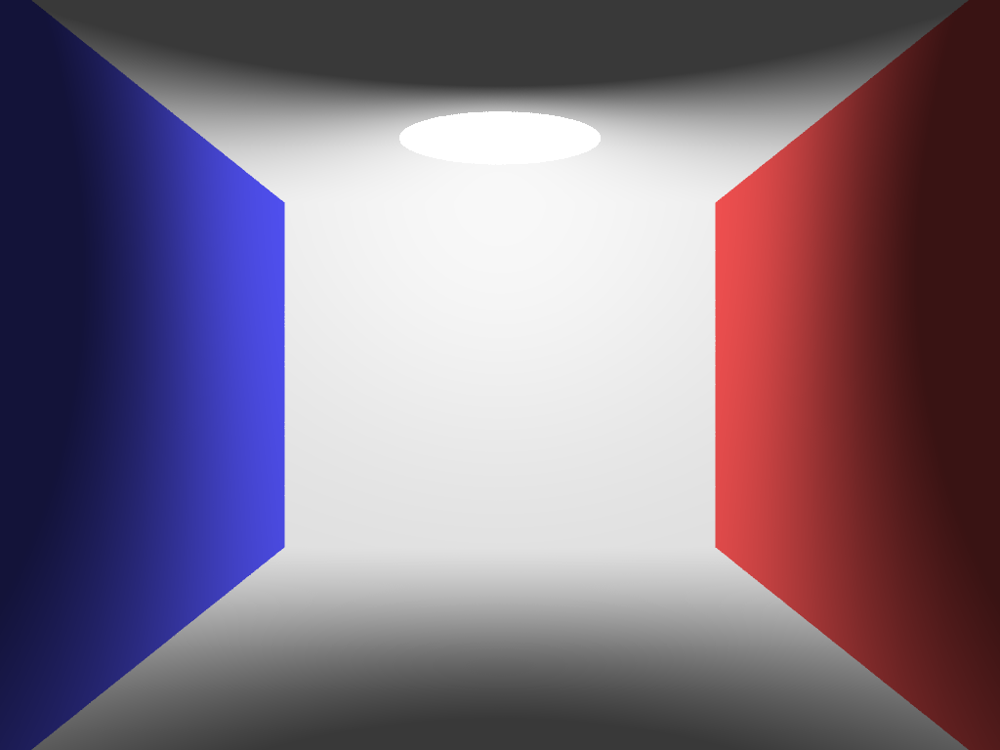
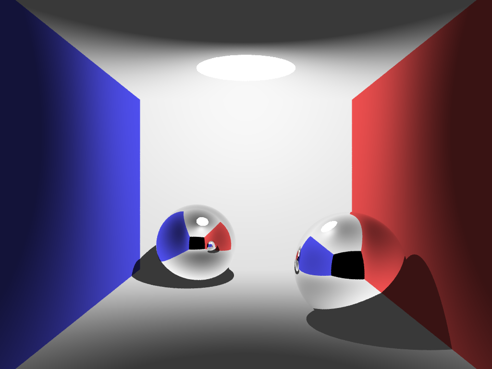
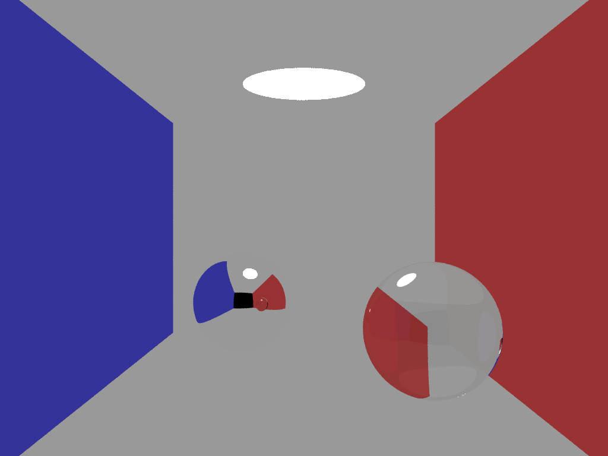
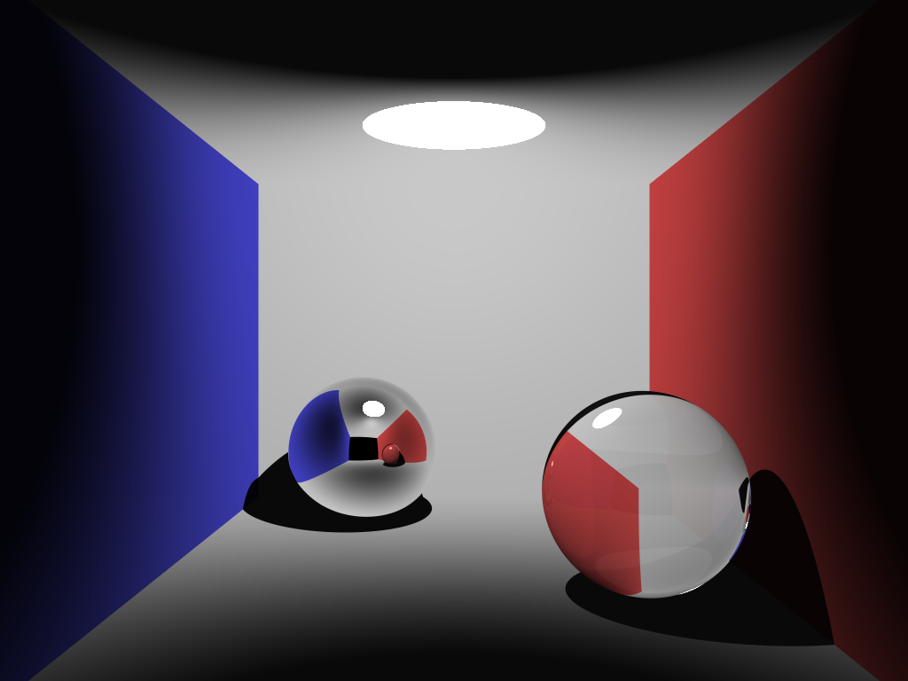
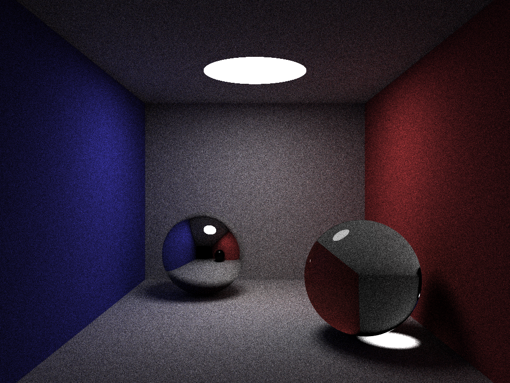

# drishti-rt
### SoC 2019 Monte Carlo Path Tracing Renderer

Here is an empty [Cornell Box](https://en.wikipedia.org/wiki/Cornell_box): 

     
Reflection + Shadows: 

     
Transmission + Shadows: 

     
Only ambient lighting: 

     
Reflection + Transmission + Shadows: 

     
Without Fresnel (constant reflectance): 

     
With Fresnel reflectance: 

     
With dynamic importance sampling added, the final image of this project (400 samples per pixel): 

     
Same as above, at a much higher sampling rate (20k samples per pixel): 

